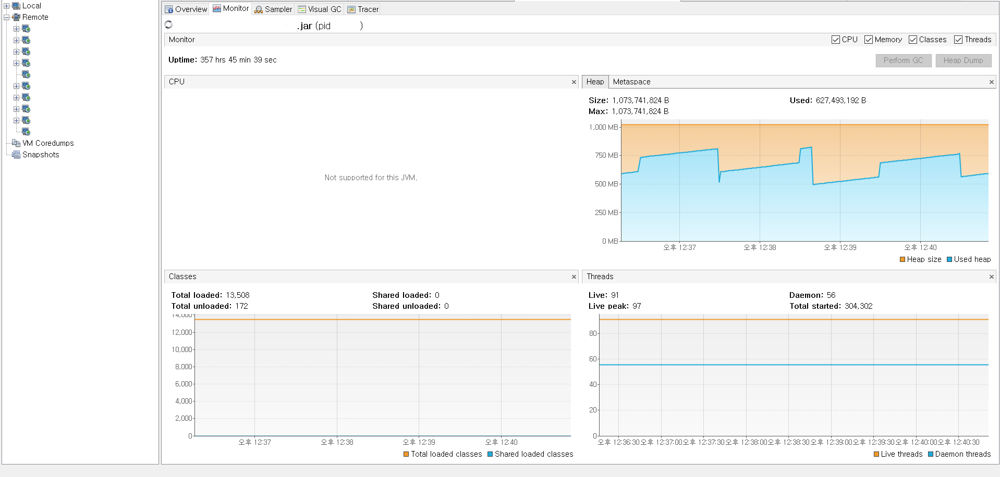

### Java visualVM
#### Java application 모니터링
- 최근 Kafka 와 관련된 문제가 발생하면서 임시로 어플리케이션 모니터링이 필요해졌다.
- 이에따라 VisualVM 을 임시로 사용

#### VisualVM 설치 경로
- (윈도우) `/자바설치경로/bin` 으로 가면 `jvisualvm.exe` 파일이 있다.
- 별도로 설치시 `https://visualvm.github.io/download.html` 를 이용하면 된다.


#### 실행
- `rmiregistry` 실행
  - `./rmiregistry port &`
- `policy 파일 생성`
  - `jstatd.all.policy`
  - ```shell
    grant codebase "file:${java.home}/../lib/tools.jar"{
        permission java.security.AllPermission;
    };
    ```
- `jstatd` 실행
  - `./jstatd -J-Djava.security.policy=jstatd.all.policy -p 1099 & `

#### 실행화면


#### 추가내용
- `Tools > Plugins > Available Plugins` 에 가면 GC 모니터링 등의 플러그인 추가로 설치 가능하다.
~~- GC 플러그인 설치해서 보니... 학생때 심심해서 찾아본, 잠깐 접했던 내용들이 보인다. (young gen(eden, survivor), old gen 등)~~